# Management setup
This setup is attempting to reduce Toil whereever possible.

## CloudInit templates
Every node (due to restrictions in the PVE Tofu Provider) has it's own CloudInit template for an Ubuntu server VM.
This template will get modified by the Tofu provider later on. It already includes a read to boot up CloudInit ready Ubuntu image, that will bootstrap itself once booted.

## Creating a VM
To create a VM, I simply create a new Git Repo from a a template. I then add a YAML file declaring the VM, and execute a script that will generate any required files based off the YAML file.

The mermaid diagram below outlines the process. For details, scroll further down.

```mermaid
flowchart TD
    subgraph CreateRepo [Create infra repository]
    direction TB
        CRA[Create repository from template] --> CRB[Clone repository locally]
    end
    subgraph DeclareInfra [Initialize Template]
    direction TB
        DIA[Write YAML Manifest for VM]
        DIB[Select ansible roles for deployment]
        DIC[Create Playbooks for role application]
        DIA --> DIB
        DIB --> DIC
    end
    CreateRepo --> DeclareInfra
    subgraph Deploy [Deploy Infrastructure]
    direction TB
        DA[Run make go]
        subgraph InitializeTemplates [Initialize Templates]
        direction BT
            ITA[List all .yaml files in terraform/]
            subgraph RenderTemplates [Render Templates]
            direction TB
                RTA[Render both templates]
                RTB[Render the template.tf.j2 template with values]
                RTC[Render the template.sh.j2 template with values]
                RTA --> RTB
                RTA --> RTC
            end
            ITA --> RenderTemplates
            RenderTemplates --> ITA
            
        end
        DA --> InitializeTemplates
        subgraph AnsibleInventory[Create Ansible Inventory: ansible/make_inventory.py]
        direction TB
            AIA[List all .yaml files in terraform/]
            AIB[Read all files from terraform/]
            AIC[Create an ansible inventory group per file]
            AIA --> AIB --> AIC
        end
        InitializeTemplates --> AnsibleInventory
        subgraph TofuDeployment [Open Tofu Deployment]
        direction TB
            TA[Run tofu apply]
            TB[Confirm changes and continue execution]
            TA --> TB
        end
        AnsibleInventory --> TofuDeployment
        subgraph CloudInitBootstrap [Cloud Init Bootstrap]
        direction TB
            CIA[Read configuration from CloudInit defaults in template]
            CIB[Add SSH Key]
            CIC[Configure password]
            CID[Configure Network]
            CIE[Update Packages]
            CIA --> CIB --> CIC --> CID --> CIE
        end
        TofuDeployment --> CloudInitBootstrap
        subgraph AnsibleDeployment [Ansible Deployment]
        direction TB
            ADA[Read all .yml files in ansible/state-playbooks/]

            subgraph ApplyPlaybook [Apply Playbook]
            direction TB
                APA[Run ansible-playbook on file]
                APB[Ansible reconciles VM state]
                APA --> APB
            end

            ADA --> ApplyPlaybook
        end
        CloudInitBootstrap --> AnsibleDeployment
    end
    SetupComplete[VM Setup complete]
    DeclareInfra --> Deploy
    Deploy --> SetupComplete
```



### Create the Repository
I create a new git repository based off this template: [https://github.com/LightJack05/Infrastructure-VM-Deployment-Template](https://github.com/LightJack05/Infrastructure-VM-Deployment-Template)

This template (on purpose) references files that are placed in a different repository: [https://github.com/LightJack05/Infrastructure-VM-Deployment-Template-Files](https://github.com/LightJack05/Infrastructure-VM-Deployment-Template-Files)

This repository contains the scripts and templates used to generate all other files. These files are kept separate to allow for easy updating of scripts globally, without having to update every single Repository.
If I do have to make a specific change to any one of the files, I can simply run a little `sed -i '' file.sh` to create an actual copy of the script, which I can then modify.

### Declare the VM
In the new repository, under the `terraform` directory, I create a new YAML file. The file should look something like this:
```yaml
deployments:
  - name: "OS-Webserver-1"
    node: 4
    num_cpus: 2
    num_mb_ram: 4096
    ipv4_address: "10.130.0.5/16"
    ipv4_gateway: "10.130.0.1"
    ipv4_dns: "10.130.0.1"
    interfaces:
      - vnet: "vnlabg"
```
This YAML file declares a VM called OS-Webserver-1, which will be deployed on node 4. It has 2 CPUs, 4GB of RAM, and a static IP address.
It's network interface is attached to the `vnlabg` VXLAN, which is one of the lab environments.

And that's it! For a basic VM just running Ubuntu, that is all I have to do to declare it.
Now, I just run `make go`, the VM gets deployed.

The template used for HCL is heavily opinionated and makes a lot of assumptions, a lot of which can be overridden if needed though.
It can support multiple network interfaces, disks and different CPU types.

### Deploy a VM
When I run `make go`, the following happens:
1. `tofu init -upgrade` runs to set up the tofu environment and make sure the provider is ready to go.
2. The `terraform/update-deployments.sh` script is executed. This script:
    - Iterates over every YAML file it finds in the `terraform` directory
    - For each YAML file, it renders the Jinja2 template `terraform/template.tf.j2`, generating the HCL file for the VM.
    - It also renders the `terraform/template.sh.j2` template, generating a script that can be used to get the genrated CloudInit passwords from terraform.
3. The `ansible/make_inventory.py` script is executed, building an ansible inventory for each file. 
    - Here, every file represents an ansible group, and every VM is added to the group with it's ansible host set to the VM's IP.
4. Now, the deployment starts, and we execute `tofu apply` to deploy the VM.
    - The CloudInit in PVE is configured so it matches the values from the YAML file.
    - A password is generated for the VM's root account and stored in tofu state.
    - The CloudInit template in Proxmox is cloned and started once configured.
    - The VM boots up, updates itself and applies any configuration from CloudInit.
5. Finally, ansible is run with the `ansible/apply_state.sh` script.
    - Ansible applies any playbooks in the `ansible/state-playbooks` directory.
    - By default, there is a `00-init.yml` playbook which includes timezone setup, auto updates as well as a firewall setup.

### Configuration and Setup
Any setup on the VM is done via Ansible, at least as far as possible.
For the most part, if a VM dies, I can simply throw it away and deploy a new one.

### Example
To see a complete example of a depoyment done via my flow, see [this repo](https://github.com/LightJack05/INF-OS-Task/)
